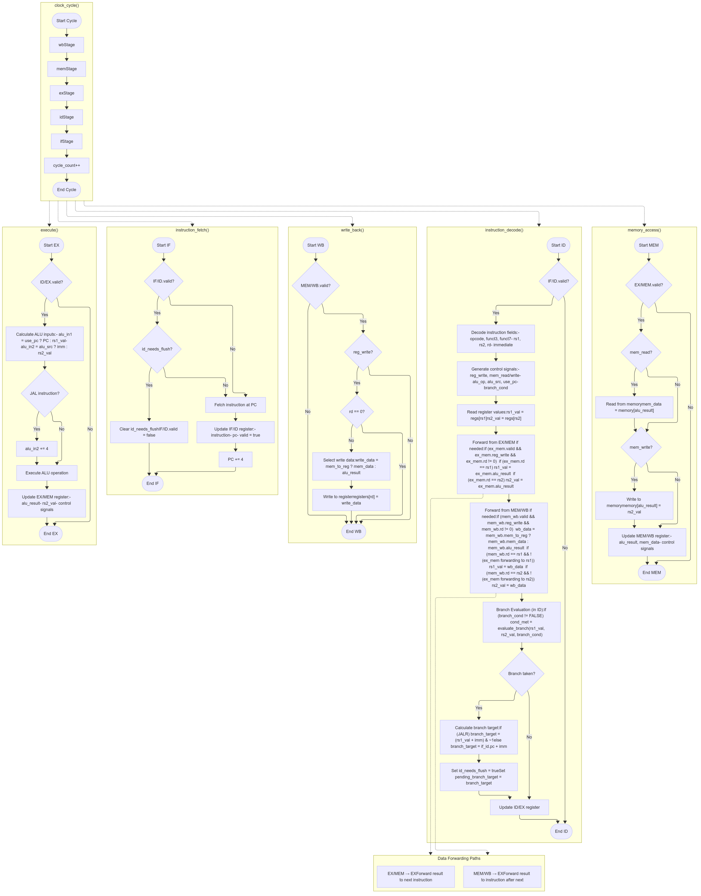
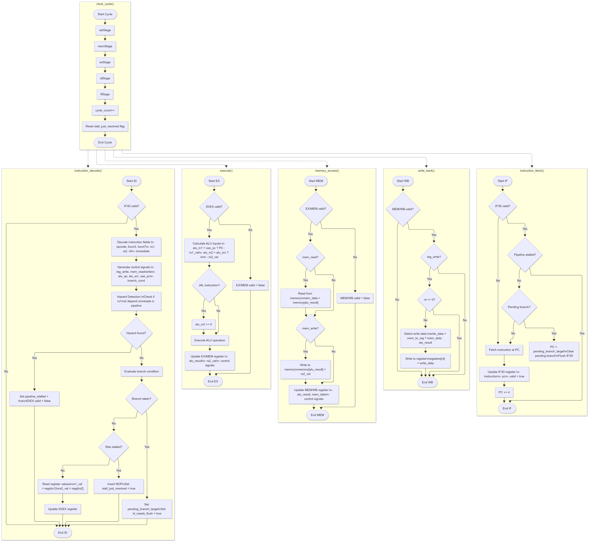

# RISC-V Simulator

This is an attempt to make the full version of the RISC-V simulator. We have used proper registers and done **ACTUAL SIMULATION**.

## Inspiration

A major inspiration was taken from:
- [ucb-bar/riscv-sodor](https://github.com/ucb-bar/riscv-sodor/tree/master/src/main/scala/sodor/rv32_5stage)
- [hehao98/RISCV-Simulator](https://github.com/hehao98/RISCV-Simulator/tree/master/src)

Note: No part was explicitly generated by AI, but github copilot was used often for resolving stupid errors, and auto completion

## Assembler

Additionally, a basic attempt at an assembler was implemented. A large part of this code was inspired from:
- [IlanIwumbwe/RISCV-assembler](https://github.com/IlanIwumbwe/RISCV-assembler/tree/main)

With the help of github co-pilot

This was purely to make testing and iterations easier.

## Project Structure

In addition to the required folders, we have:
- `dev/`: Contains the original, dirtier code (much of which was removed, but some was retained as backup)
- `test/`: Contains programs in assembly (mostly used for testing)

## Execution

```bash
make
```
This commands makes binaries in `./` folder
```bash
./forward
./noforward
./assembly-no-forwarding
./assembly-forwarding
```

and 

```bash
make clean
```

Removes them.

## Known Issues


1. `jal ra num`: Links to `PC` instead of `PC + 4` This issue is not present in `jalr`.
2. The assembler and processor, if given syntatically wrong assembly code, flags possible errors in debug mode, but does not invalidate the code
3. Incorrect Machine is incorrectly executed and not interrupted. It is the users responsibility to sanely put correct machine code!

## Design Decisions in Code and Processor

1. Made helper functions that are then abstracted in the 5 stages which is abstracted to the processor

2. Most of the code was used to do case matching, and then assign signals accordingly

3. Profusely logging outputs everywhere helped us to resolve and pick out issues quickly 

## Images

Below are the images showcasing the processor's behavior:

- **Forwarding Enabled**  
    

- **No Forwarding**  
    


